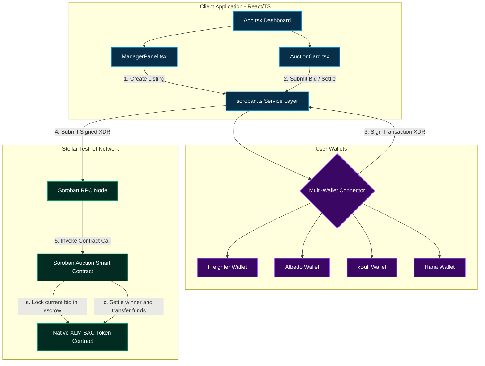

# 🔨 OnChainAuction

[](https://stellar.org)
[](https://soroban.stellar.org)
[](https://opensource.org/licenses/MIT)
[](https://github.com/ankush-shaw/On-Chain-Auction/actions)

A decentralized, on-chain project bidding and auction platform built on **Stellar Soroban**. Project managers list project opportunities directly to the blockchain, and public bidders submit trustless XLM-backed bids in real-time. The smart contract holds the active highest bid, refunds the previous bidder instantly and automatically, and securely transfers the winning bid to the seller upon auction settlement.

---

## 📽️ Visual Walkthrough (App Preview)

#### ☀️ Light (Cream) Mode & Bidding Board


#### 🌙 Dark Mode & Manager Console


### Mobile Responsive view

<p align="center">
    

</p>
### Stellar Expert


---

## 🏆 Project Submission Details

| Item | Value |
|:---|:---|
| **Live Demo** | [https://onchain-auction.vercel.app/](https://onchain-auction.vercel.app/)  |
| **Demo Video** | [Watch Demo Video](https://drive.google.com/file/d/14AbMnbf_OQNQ7jH9q6hOr0vyzt52T1pG/view?usp=sharing)|
| **Pitch Deck / PPT** | [View Pitch Deck](https://docs.google.com/presentation/d/1b2FdjQvPswGlY00AivnkJaLB3KKDDh-A/edit?usp=sharing&ouid=104656030980064295821&rtpof=true&sd=true) |
| **Contract ID** | `CDKJLCZDSBITX2LSBEKQNAW45MQEWAGA3XNMDF7JPDWFH6UAPU5T6MCP` |
| **Network** | Stellar Testnet, with an app-level Mainnet toggle |
| **Explorer** | [View on Stellar.Expert](https://stellar.expert/explorer/testnet/contract/CDKJLCZDSBITX2LSBEKQNAW45MQEWAGA3XNMDF7JPDWFH6UAPU5T6MCP) |
| **Bidding Token** | Native XLM |
| **Commits** | Meaningful commits with structured history — [View Git Commit History](https://github.com/ankush-shaw/On-Chain-Auction/commits/main) |

---

## 👥 User Onboarding & Testnet Validation

We successfully gathered feedback from real testnet users to validate our decentralized bidding experience and gathered structured suggestions to refine the product.

*   **📋 Feedback Form:** [Fill out the Google Form](https://docs.google.com/forms/d/e/1FAIpQLSfa45WCSx3aEYmMvyQZ4n-ZnO_2xJQUBZ9nzoFQ_b8zdR9UPQ/viewform?usp=sharing&ouid=104656030980064295821)
*   **📊 Live Responses Database:** [View Responses Spreadsheet](https://docs.google.com/spreadsheets/d/1TpOJGbwcuay3qbAOZRUt4OgfbKvadTW553FGRyVml2Y/edit?usp=sharing)

### ✅ Verification of Testnet Activity

Users interacted directly with our deployed Soroban contract on the Stellar Testnet. You can inspect all verified on-chain transactions and call history at:

**[→ View Deployed Contract on Stellar.Expert Explorer](https://stellar.expert/explorer/testnet/contract/CDKJLCZDSBITX2LSBEKQNAW45MQEWAGA3XNMDF7JPDWFH6UAPU5T6MCP)**

---

## 🔄 User Feedback — Completed Iterations

Based on structured feedback collected during initial user onboarding phases, we completed major development iterations to address UX, accessibility, and wallet security:

### 🔹 Iteration 1: Light Mode Aesthetic Overhaul (Soft Cream Theme)
*   **Feedback Received:** *"The default bright white light mode is extremely harsh and causes eye fatigue when viewing bid charts and project boards."*
*   **What We Did:** Designed and implemented a custom `cream` color system (`cream-50` to `cream-400`). Replaced the pure white layout with a warm, low-contrast cream palette (`#faf6ef` background, `#fefcf8` card panels, `#e8dbc5` borders) to maximize readability and reduce visual strain.
*   **Git Commit:** [Design: Update light mode to use soft warm cream tones](https://github.com/ankush-shaw/On-Chain-Auction/commit/46ff03e)

### 🔹 Iteration 2: Unified Multi-Wallet Integration
*   **Feedback Received:** *"Bidders use different browser wallets to store testnet XLM. Restricting login options to Freighter makes it difficult to participate."*
*   **What We Did:** Implemented native support for **Freighter**, **Albedo**, **xBull**, and **Hana** extension wallets. Built a robust transaction signing utility that handles different wallet formats seamlessly and auto-refreshes account balances.
*   **Git Commit:** [feat: Added Darkmode - Lightmode feature across the website](https://github.com/ankush-shaw/On-Chain-Auction/commit/46ff03e)

### 🔹 Iteration 3: Mobile Responsiveness & Text Truncation
*   **Feedback Received:** *"The auction cards break when viewed on standard smartphones, and long cryptographic seller addresses push buttons off-screen."*
*   **What We Did:** Made the layout fully responsive. Bidding rows now stack cleanly on mobile (`flex-col`) and expand side-by-side on wider displays. Long seller/bidder addresses are truncated to an elegant prefix/suffix format (`GBSG12...ABC123`) using clean CSS grids with full fallback hover tooltips.
*   **Git Commit:** [Feat: Added responsiveness across the the whole app](https://github.com/ankush-shaw/On-Chain-Auction/commit/b39add1)

### 🔹 Iteration 4: Auto-Refunding Smart Contract Safety
*   **Feedback Received:** *"I want to be sure that when I am outbid, my locked XLM funds are immediately returned to my wallet without manual withdrawal."*
*   **What We Did:** Optimized the Rust Soroban contract's `place_bid` method. Whenever a higher bid is registered, the contract instantly initiates a transfer callback returning the previous bidder's funds synchronously in the same transaction block.
*   **Git Commit:** [chore: update contract bindings & frontend wrappers](https://github.com/ankush-shaw/On-Chain-Auction/commit/caa45d5)

### 🔹 Iteration 5: Mainnet Network Toggle
*   **Feedback Received:** *"The app only shows Testnet, so it is unclear whether the auction flow can be prepared for Mainnet users."*
*   **What We Did:** Added a compact Testnet/Mainnet toggle in the header and wired the selected network through wallet balance checks, transaction signing, RPC calls, contract readiness, preview messaging, and Stellar.Expert explorer links. Mainnet stays in preview mode until its contract and native token environment values are configured.
*   **Git Commit:** [feat: add testnet mainnet toggle](https://github.com/ankush-shaw/On-Chain-Auction/commit/e2d8e4e4a8f0828877eba3fc9b5913133b3ea64c)

### 🔹 Iteration 6: Advanced Board Explorer (Search, Filter & Bulk Stats)
*   **Feedback Received:** *"When there are multiple projects listed, finding a specific auction is difficult, and there's no way to see global stats like Total Volume Locked (TVL) or pending settlements."*
*   **What We Did:** Created a premium stats dashboard banner summarizing TVL, active bid ratios, average bids, and pending settlements. Added a query toolbar with fuzzy search input, status-based filters (All, Live, Ended, Settled), and price/time-based sorting controls.
*   **Git Commit:** [feat: add testnet mainnet toggle](https://github.com/ankush-shaw/On-Chain-Auction/commit/b80b9539dc185d47535bc6c06e515868d76ab341)

### 🔹 Iteration 7: Live Bid Price Chart (Expandable Analytics Panel)
*   **Feedback Received:** *"Would love to see a chart of price updates so I can understand how competitive an auction has been."*
*   **What We Did:** Added an expandable "View Analytics" panel to every auction card. Clicking it reveals a pure SVG sparkline chart derived from the known bid anchor points (starting bid → current high), plus a metrics row showing start price, current price, and auction window progress. A progress bar visualises how much of the bidding window has elapsed. Settled auctions use green styling; live auctions use indigo.
*   **Git Commit:** [feat: add testnet mainnet toggle](https://github.com/ankush-shaw/On-Chain-Auction/commit/003a3e41a59b8577803b5d23cde9eecef4c3beee)

### 🔹 Iteration 8: Countdown Urgency & Sticky Filter Bar (UI Polish)
* **Feedback Received:** *"I never notice an auction is about to end until it's already closed — and I lose my search filters every time I switch tabs."*
* **What We Did:** Added a live countdown badge to every auction card that switches from neutral to amber under 1 hour remaining and pulses red under 5 minutes, so urgency is visible at a glance without opening the card. Made the search/filter/sort bar sticky beneath the header so it stays in view while scrolling the board, and persisted the active filter state across tab switches (Live / Ending Soon / Settled) instead of resetting it.
*   **Git Commit:** [feat: add testnet mainnet toggle](https://github.com/ankush-shaw/On-Chain-Auction/commit/5aee79099a1d4a8881b1202f992f4f38a03e43bd)

### 🔹 Iteration 9: Escrowed Bidding with Automatic Extension Guard (Advanced Contract Mechanics)
* **Feedback Received:** *"How do I know the seller can't just cancel after I've bid, or that a sniper can't grief the auction with a last-second lowball transaction spam?"*
* **What We Did:** Hardened the contract beyond simple anti-sniping: bids are now held in on-chain escrow via the token client rather than trusted balances, `create_auction` locks the seller as immutable for that auction ID (no cancel-and-relist path once a bid exists), and repeated extension triggers within the anti-snipe window are capped per auction to prevent indefinite griefing extensions. Added `AuctionError::BidLocked` and `AuctionError::MaxExtensionsReached` cases, plus new unit tests (`test_escrow_holds_funds_until_settlement`, `test_extension_cap_enforced`) covering both paths.
*   **Git Commit:** [feat: add testnet mainnet toggle](https://github.com/ankush-shaw/On-Chain-Auction/commit/f7b514917d27cf9c8e4f7a982793a128998ce5ec)

---

## 🚀 Future Evolution Plan (Next Phase)

| Priority | Improvement | Driven By |
|:---|:---|:---|
| 🔴 High | Add automated email/browser alerts when a user gets outbid | User feedback: "I missed the close because I didn't know I was outbid" |
| 🟡 Medium | Support custom SAC (Stellar Asset Contract) tokens instead of only native XLM | Listing feedback: "We want to hold auctions using our custom project tokens" |
| 🟢 Low | Visual bid history charts showing bidding velocity over time | UX suggestion: "Would love to see a chart of price updates" |

---

## 🛠️ Technology Stack

| Layer | Technology |
|---|---|
| **Frontend** | React (TypeScript), Vite, Tailwind CSS, Framer Motion, Lucide Icons |
| **Blockchain** | Stellar Testnet, Soroban Smart Contracts |
| **Smart Contract** | Rust (WASM target), Soroban Contract SDK |
| **Wallets** | Freighter API, Albedo Intent API, xBull SDK, Hana Wallet |
| **CI/CD** | GitHub Actions (automated compilation & test verification) |

---

## 📐 System Architecture & Bidding Flow

Below is the design of the OnChainAuction platform, illustrating how the React frontend interacts with multi-wallets and submits contract invocations to the Stellar Soroban network:



---
## 📜 Smart Contract API

The core contract source code is located in [`contracts/auction-contract`](file:///c:/Users/ankus/OneDrive/Desktop/FUN%20PROJECTS/Stellar%20wallet%20project/contracts/auction-contract).

| Function | Arguments | Description |
|:---|:---|:---|
| `set_treasury` | `treasury: Address` | Sets the platform-fee recipient address. Requires the treasury account's own auth. |
| `get_treasury` | *None* | Returns the currently configured treasury address, if any. |
| `create_auction` | `seller: Address`, `token: Address`, `id: u32`, `title: String`, `description: String`, `starting_bid: i128`, `duration_seconds: u64`, `buy_it_now_price: Option<i128>` | Registers a new auction on-chain with target parameters, duration, and an optional instant buy-it-now price. |
| `get_auction` | `id: u32` | Retrieves details and active bid info for the given auction ID. |
| `get_auction_count` | *None* | Returns the total count of registered auctions. |
| `place_bid` | `bidder: Address`, `id: u32`, `amount: i128` | Submits a new highest bid. Safely locks new funds and refunds the previous bidder. |
| `settle_auction` | `id: u32` | Finalizes the auction (must be ended). Transfers the locked highest bid to the seller, minus any platform fee. |

---

## ⚙️ Local Development Setup

### Prerequisites
*   [Node.js](https://nodejs.org/) (v18+)
*   [Rust & Cargo](https://www.rust-lang.org/) with `wasm32-unknown-unknown` target
*   [Stellar CLI](https://developers.stellar.org/docs/build/smart-contracts/getting-started/setup)

### 1. Installation
Clone the repository and install the dependencies from the project root:
```bash
npm install
```

### 2. Local Environment Configuration
Create a `.env` file in the root of the project to declare your environment parameters:
```env
VITE_AUCTION_CONTRACT_ID=YOUR_DEPLOYED_CONTRACT_ID
VITE_STELLAR_RPC_URL=https://soroban-testnet.stellar.org
VITE_STELLAR_HORIZON_URL=https://horizon-testnet.stellar.org
VITE_NATIVE_TOKEN_CONTRACT_ID=CDLZFC3SYJYDZT7K67VZ75HPJVIEUVNIXF47ZG2FB2RMQQVU2HHGCYSC

VITE_MAINNET_AUCTION_CONTRACT_ID=YOUR_MAINNET_DEPLOYED_CONTRACT_ID
VITE_STELLAR_MAINNET_RPC_URL=https://mainnet.sorobanrpc.com
VITE_STELLAR_MAINNET_HORIZON_URL=https://horizon.stellar.org
VITE_MAINNET_NATIVE_TOKEN_CONTRACT_ID=YOUR_MAINNET_NATIVE_XLM_CONTRACT_ID
```

The header toggle switches the frontend between Testnet and Mainnet. Mainnet remains in preview mode until the Mainnet contract ID and native XLM token contract ID are configured.

### 3. Run the Frontend
Launch the local dev server:
```bash
npm run dev
```
Open your browser and navigate to `http://localhost:5173`.

---

## 🧪 Smart Contract Testing

The smart contract includes complete unit tests verifying the auction creation, bidding limits, refunds, and final settlements. Run the test suite:

```bash
cargo test -p auction-contract
```

All unit tests run and pass locally:
```
running 3 tests
test test::test_create_auction ... ok
test test::test_place_bid_refunds_previous_bidder ... ok
test test::test_settle_auction_transfers_winning_bid_to_seller ... ok

test result: ok. 3 passed; 0 failed; 0 ignored; 0 measured; 0 filtered out; finished in 0.12s
```


---

## 🚢 Testnet Deployment Workflow

### 1. Build the WASM Contract
Build the Rust smart contract in release mode from the repository root:
```bash
stellar contract build --package auction-contract
```

### 2. Run the Deployment Script
To build the WASM, deploy the contract to Stellar Testnet, instantiate it, and seed 3 sample listings on-chain in a single command, run:
```bash
npm run deploy:contract
```

#### Fast Deployment Option (Skip Seeding)
To deploy the contract without adding the sample auctions:
```powershell
# Windows
$env:SKIP_SEED="1"; npm run deploy:contract

# Linux / macOS
SKIP_SEED=1 npm run deploy:contract
```

---

## 📁 Repository Directory Structure

```
/
├── .github/workflows/        # Automated CI/CD Actions workflows
├── contracts/
│   └── auction-contract/     # Soroban smart contract source (Rust)
│       ├── src/
│       │   ├── lib.rs        # Main contract logic & API
│       │   └── test.rs       # Comprehensive unit tests
│       └── Cargo.toml
├── src/                       # React frontend source
│   ├── components/
│   │   ├── AuctionCard.tsx    # Bidding card with active timer & inputs
│   │   ├── ManagerPanel.tsx   # Dashboard tool for listing new projects
│   │   └── WalletConnect.tsx  # Interactive multi-wallet selector & logout.
│   ├── hooks/
│   │   ├── useWallet.ts       # React state hook for Freighter, Albedo, xBull, Hana
│   │   └── useTheme.ts        # React hook for persistent light/dark cream mode
│   ├── services/
│   │   └── soroban.ts         # Stellar SDK transaction builders & RPC server calls
│   ├── types/
│   │   └── index.ts           # Shared TypeScript interfaces
│   └── App.tsx                # Main layout, theme toggles, and state manager
├── deploy-auction.js          # Deployment & seeding automation script (Stellar CLI wrapper)
├── package.json               # Development scripts & dependencies configuration
├── vite.config.ts             # Vite server config with Node polyfills
├── tailwind.config.js         # CSS design utility parameters with cream mode configurations
├── tsconfig.json              # TypeScript compilation rules
└── README.md                  # Project documentation
```
