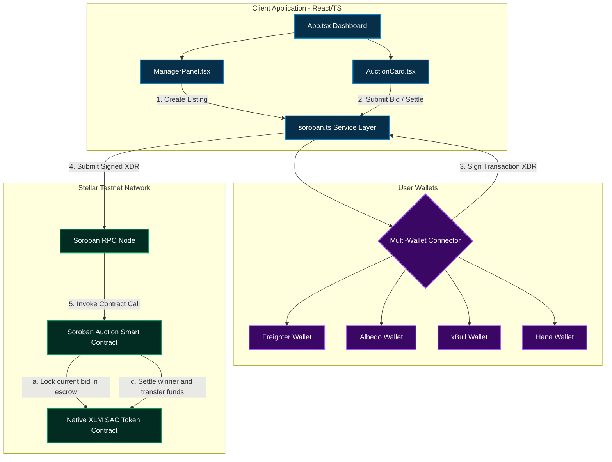

# BidX

[](https://stellar.org)
[](https://soroban.stellar.org)
[](https://opensource.org/licenses/MIT)
[](https://github.com/ankush-shaw/BidX/actions)

BidX is a decentralized, on-chain project bidding and auction platform built on **Stellar Soroban**. Project managers list opportunities directly on-chain, and public bidders submit trustless XLM-backed bids in real time. The smart contract escrows the active highest bid, instantly refunds the previous bidder on every outbid, and settles the winning bid to the seller once the auction closes.

## 🌐 Live Demo

- **Live Demo URL:** [https://onchain-auction.vercel.app/](https://onchain-auction.vercel.app/)
- **Demo Video:** [Watch on Google Drive](https://drive.google.com/file/d/14AbMnbf_OQNQ7jH9q6hOr0vyzt52T1pG/view?usp=sharing)
- **Pitch Deck:** [View Presentation](https://docs.google.com/presentation/d/1b2FdjQvPswGlY00AivnkJaLB3KKDDh-A/edit?usp=sharing&ouid=104656030980064295821&rtpof=true&sd=true)

## 📸 Platform Screenshots

### Light (Cream) Mode & Bidding Board


### Dark Mode & Manager Console


### Mobile Responsive View
<p align="center">
    
</p>

*The application is fully responsive and supports secure, trustless bidding across all devices.*

## ✅ CI/CD Pipeline Status

[](https://github.com/ankush-shaw/BidX/actions)

**Pipeline runs:**
- Node dependency installation
- Frontend build verification (Vite + TypeScript)
- Rust Soroban contract compilation & unit tests
- Automated on every push to `main`

## 🧪 Smart Contract Testing

The Soroban auction contract includes unit tests covering auction creation, bidding limits, refunds, escrow, and final settlement.

```
running 3 tests
test test::test_create_auction ... ok
test test::test_place_bid_refunds_previous_bidder ... ok
test test::test_settle_auction_transfers_winning_bid_to_seller ... ok

test result: ok. 3 passed; 0 failed; 0 ignored; 0 measured; 0 filtered out; finished in 0.12s
```

Run the suite locally:
```bash
cargo test -p auction-contract
```


## 🏗️ Smart Contract Overview

### Auction Contract

**Features:**
- Auction creation with configurable duration and optional buy-it-now price
- Escrowed bidding — funds are held via the token client, not trusted balances
- Automatic, synchronous refund of the outbid party in the same transaction
- Immutable seller lock once a bid exists (no cancel-and-relist)
- Anti-snipe extension window with a per-auction extension cap
- Platform-fee settlement to a configurable treasury address on close

| Function | Arguments | Description |
|:---|:---|:---|
| `set_treasury` | `treasury: Address` | Sets the platform-fee recipient address. Requires the treasury account's own auth. |
| `get_treasury` | *None* | Returns the currently configured treasury address, if any. |
| `create_auction` | `seller: Address`, `token: Address`, `id: u32`, `title: String`, `description: String`, `starting_bid: i128`, `duration_seconds: u64`, `buy_it_now_price: Option<i128>` | Registers a new auction on-chain with target parameters, duration, and an optional instant buy-it-now price. |
| `get_auction` | `id: u32` | Retrieves details and active bid info for the given auction ID. |
| `get_auction_count` | *None* | Returns the total count of registered auctions. |
| `place_bid` | `bidder: Address`, `id: u32`, `amount: i128` | Submits a new highest bid. Locks new funds in escrow and refunds the previous bidder. |
| `settle_auction` | `id: u32` | Finalizes the auction (must be ended). Transfers the locked highest bid to the seller, minus any platform fee. |

## 📋 Contract Details

(Deployed on Stellar Testnet)

```
Contract ID:  CDKJLCZDSBITX2LSBEKQNAW45MQEWAGA3XNMDF7JPDWFH6UAPU5T6MCP
Bidding Token: Native XLM
```

### 🔍 View on Explorer

Inspect verified on-chain transactions and call history on the Stellar Development Foundation Testnet Explorer:
[Stellar.Expert — CDKJLC...5T6MCP](https://stellar.expert/explorer/testnet/contract/CDKJLCZDSBITX2LSBEKQNAW45MQEWAGA3XNMDF7JPDWFH6UAPU5T6MCP)

## 👥 User Onboarding & Testnet Validation

Real testnet users interacted with the deployed contract and provided structured feedback that shaped nine completed development iterations — covering theme accessibility, multi-wallet support, mobile responsiveness, auto-refunding safety, mainnet readiness, board search/filtering, live analytics, countdown urgency, and escrowed bidding with anti-snipe protection.

- **📋 Feedback Form:** [Fill out the Google Form](https://docs.google.com/forms/d/e/1FAIpQLSfa45WCSx3aEYmMvyQZ4n-ZnO_2xJQUBZ9nzoFQ_b8zdR9UPQ/viewform?usp=sharing&ouid=104656030980064295821)
- **📊 Live Responses Database:** [View Responses Spreadsheet](https://docs.google.com/spreadsheets/d/1TpOJGbwcuay3qbAOZRUt4OgfbKvadTW553FGRyVml2Y/edit?usp=sharing)
- **📜 Full Iteration Log:** [View Git Commit History](https://github.com/ankush-shaw/BidX/commits/main)

## 🛠️ Features

- **Multi-Wallet Authentication:** Native integration with **Freighter**, **Albedo**, **xBull**, and **Hana** wallets for secure signing and balance sync.
- **Bidding Board:** Live auction listings with fuzzy search, status filters (Live, Ended, Settled), and price/time sorting.
- **Manager Console:** Dedicated dashboard for creating and tracking project listings.
- **Live Analytics:** Expandable per-auction SVG price chart with start/current price and auction-window progress.
- **Countdown Urgency:** Live countdown badges that escalate from neutral → amber → pulsing red as an auction nears its close.
- **Escrowed Settlement:** On-chain escrow with automatic outbid refunds and capped anti-snipe extensions.
- **Testnet/Mainnet Toggle:** App-level network switch wired through wallets, RPC calls, and explorer links.
- **Cream & Dark Themes:** Low-contrast cream palette for light mode, full dark mode support.
- **Mobile Responsive:** Fully responsive layout with address truncation and hover tooltips.

## 💻 Tech Stack

| Layer | Technology |
|---|---|
| **Frontend** | React (TypeScript), Vite, Tailwind CSS, Framer Motion, Lucide Icons |
| **Blockchain** | Stellar Testnet, Soroban Smart Contracts |
| **Smart Contract** | Rust (WASM target), Soroban Contract SDK |
| **Wallets** | Freighter API, Albedo Intent API, xBull SDK, Hana Wallet |
| **CI/CD** | GitHub Actions (automated compilation & test verification) |

## 📐 System Architecture



## 📦 How to Run Locally

**Prerequisites**
- [Node.js](https://nodejs.org/) (v18+)
- [Rust & Cargo](https://www.rust-lang.org/) with `wasm32-unknown-unknown` target
- [Stellar CLI](https://developers.stellar.org/docs/build/smart-contracts/getting-started/setup)

1. Clone the repository:
```bash
git clone https://github.com/ankush-shaw/BidX.git
cd BidX
```

2. Install dependencies:
```bash
npm install
```

3. Create a `.env` file in the project root:
```env
VITE_AUCTION_CONTRACT_ID=YOUR_DEPLOYED_CONTRACT_ID
VITE_STELLAR_RPC_URL=https://soroban-testnet.stellar.org
VITE_STELLAR_HORIZON_URL=https://horizon-testnet.stellar.org
VITE_NATIVE_TOKEN_CONTRACT_ID=CDLZFC3SYJYDZT7K67VZ75HPJVIEUVNIXF47ZG2FB2RMQQVU2HHGCYSC

VITE_MAINNET_AUCTION_CONTRACT_ID=YOUR_MAINNET_DEPLOYED_CONTRACT_ID
VITE_STELLAR_MAINNET_RPC_URL=https://mainnet.sorobanrpc.com
VITE_STELLAR_MAINNET_HORIZON_URL=https://horizon.stellar.org
VITE_MAINNET_NATIVE_TOKEN_CONTRACT_ID=YOUR_MAINNET_NATIVE_XLM_CONTRACT_ID
```
The header toggle switches the frontend between Testnet and Mainnet. Mainnet stays in preview mode until its contract ID and native XLM token contract ID are configured.

4. Run the development server:
```bash
npm run dev
```

5. Access at `http://localhost:5173`

## 🧪 Running Tests

```bash
cargo test -p auction-contract
```

## 🚀 Deployment

### Frontend
1. Connect this repository to **Vercel** or **Netlify**
2. Configure build command: `npm run build`
3. Deploy automatically on push to `main`

### Smart Contract
1. Build the WASM contract:
```bash
stellar contract build --package auction-contract
```

2. Deploy and seed sample listings in one step:
```bash
npm run deploy:contract
```

Skip seeding with:
```bash
# Windows
$env:SKIP_SEED="1"; npm run deploy:contract

# Linux / macOS
SKIP_SEED=1 npm run deploy:contract
```

## 📚 Project Structure

```
/
├── .github/workflows/        # Automated CI/CD Actions workflows
├── contracts/
│   └── auction-contract/     # Soroban smart contract source (Rust)
│       ├── src/
│       │   ├── lib.rs        # Main contract logic & API
│       │   └── test.rs       # Comprehensive unit tests
│       └── Cargo.toml
├── src/                       # React frontend source
│   ├── components/
│   │   ├── AuctionCard.tsx    # Bidding card with active timer & inputs
│   │   ├── ManagerPanel.tsx   # Dashboard tool for listing new projects
│   │   └── WalletConnect.tsx  # Interactive multi-wallet selector & logout
│   ├── hooks/
│   │   ├── useWallet.ts       # React state hook for Freighter, Albedo, xBull, Hana
│   │   └── useTheme.ts        # React hook for persistent light/dark cream mode
│   ├── services/
│   │   └── soroban.ts         # Stellar SDK transaction builders & RPC server calls
│   ├── types/
│   │   └── index.ts           # Shared TypeScript interfaces
│   └── App.tsx                # Main layout, theme toggles, and state manager
├── deploy-auction.js          # Deployment & seeding automation script (Stellar CLI wrapper)
├── package.json               # Development scripts & dependencies configuration
├── vite.config.ts             # Vite server config with Node polyfills
├── tailwind.config.js         # CSS design utility parameters with cream mode configurations
├── tsconfig.json              # TypeScript compilation rules
└── README.md                  # Project documentation
```

## 🔗 Useful Resources

- [Stellar Documentation](https://developers.stellar.org/)
- [Soroban Smart Contracts](https://soroban.stellar.org/)
- [Vite Documentation](https://vitejs.dev/)
- [Tailwind CSS](https://tailwindcss.com/)

## 🎯 Future Evolution Plan

| Priority | Improvement | Driven By |
|:---|:---|:---|
| 🔴 High | Automated email/browser alerts when a user gets outbid | "I missed the close because I didn't know I was outbid" |
| 🟡 Medium | Support custom SAC tokens instead of only native XLM | "We want to hold auctions using our custom project tokens" |
| 🟢 Low | Visual bid history charts showing bidding velocity over time | "Would love to see a chart of price updates" |

## 📄 License

Released under the [MIT License](https://opensource.org/licenses/MIT).
