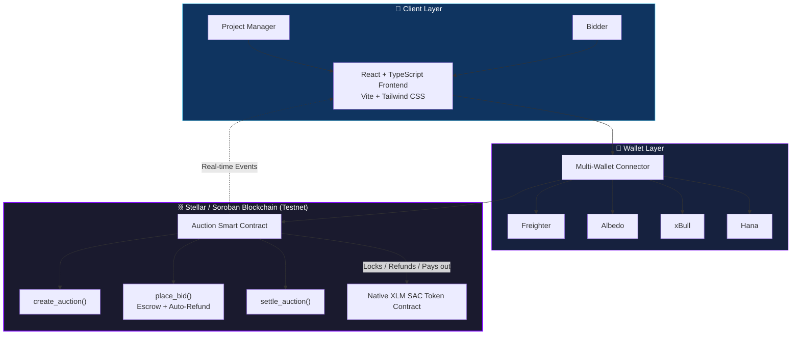
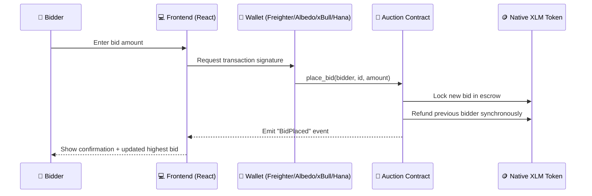

<div align="center">

#  BidX
### Decentralized On-Chain Project Bidding & Auction Platform

**Built on Stellar / Soroban** — trustless XLM-backed bidding with instant escrow refunds and automatic settlement.

[](https://github.com/pushpa-p7/BidX/actions/workflows/ci.yml)


[🌐 Live Demo](https://bid-x-cyan.vercel.app/) · [🎥 Demo Video](https://drive.google.com/file/d/14AbMnbf_OQNQ7jH9q6hOr0vyzt52T1pG/view?usp=sharing)

</div>

---

## 📑 Table of Contents

- [Overview](#-overview)
- [Live Demo](#-live-demo)
- [Architecture](#️-architecture)
- [How a Bid Is Placed (Contract Flow)](#-how-a-bid-is-placed-contract-flow)
- [Platform Screenshots](#-platform-screenshots)
- [CI/CD Pipeline Status](#-cicd-pipeline-status)
- [Smart Contract Overview](#️-smart-contract-overview)
- [Contract Details](#-contract-details)
- [Features](#️-features)
- [Tech Stack](#-tech-stack)
- [How to Run Locally](#-how-to-run-locally)
- [Running Tests](#-running-tests)
- [Deployment](#-deployment)
- [Project Structure](#-project-structure)
- [User Onboarding & Testnet Validation](#-user-onboarding--testnet-validation)
- [Useful Resources](#-useful-resources)
- [License](#-license)
- [Future Evolution Plan](#-future-evolution-plan)

## LINK-

https://stellar.expert/explorer/testnet/contract/CDKJLCZDSBITX2LSBEKQNAW45MQEWAGA3XNMDF7JPDWFH6UAPU5T6MCP


---

## 🧬 Overview

**BidX** is a decentralized, on-chain project bidding and auction platform built on the **Stellar/Soroban** blockchain. Project managers list opportunities directly to the chain, and public bidders submit trustless XLM-backed bids in real time — no intermediary ever holds the funds.

At its core, BidX solves a real trust problem in traditional bidding: sellers can't quietly favor a bidder, and bidders can't be left waiting on a manual refund after being outbid. The Soroban contract escrows every active bid, refunds the previous bidder synchronously the moment a higher bid lands, and settles the winning bid to the seller automatically once the auction closes — all verifiable on-chain.

---

## 🌐 Live Demo

| Resource | Link |
|---|---|
| 🚀 Live App | [onchain-auction.vercel.app](https://onchain-auction.vercel.app/) |
| 🎥 Demo Video | [Watch on Google Drive](https://drive.google.com/file/d/14AbMnbf_OQNQ7jH9q6hOr0vyzt52T1pG/view?usp=sharing) |
| ⚙️ CI Pipeline | [GitHub Actions](https://github.com/pushpa-p7/BidX/actions) |

---

## 🏗️ Architecture

BidX is split into three cooperating layers: a **React/Vite frontend** that managers and bidders interact with, a **multi-wallet signing layer**, and an **on-chain Soroban layer** that governs auction state, escrow, and settlement.



**Layer breakdown:**

- **Client Layer** — Managers and bidders interact through a responsive React + TypeScript interface built with Vite, Tailwind CSS, and Framer Motion.
- **Wallet Layer** — A unified multi-wallet connector supports Freighter, Albedo, xBull, and Hana, each signing transactions locally so private keys never leave the user's device.
- **On-Chain Layer (Soroban)** — The Auction Contract handles listing creation, bid escrow, anti-snipe extensions, and final settlement, with every state change verifiable on Stellar.Expert.

---

## 🔄 How a Bid Is Placed (Contract Flow)



The main contract never trusts an external service to issue refunds — the escrow release and the new lock happen in the same transaction block, on-chain.

---

## 📸 Platform Screenshots

### Light (Cream) Mode & Bidding Board


### Dark Mode & Manager Console


### Mobile Responsive View


*The application is fully responsive and supports secure, trustless bidding across all devices.*

---

## ✅ CI/CD Pipeline Status

[](https://github.com/pushpa-p7/BidX/actions/workflows/ci.yml)

**Pipeline runs:**
- ✅ Node dependency installation
- ✅ Frontend build verification (Vite + TypeScript)
- ✅ Rust Soroban contract compilation & unit tests
- ✅ Automated on push to `main`

### Passing Smart Contract Tests

```text
running 3 tests
test test::test_create_auction ... ok
test test::test_place_bid_refunds_previous_bidder ... ok
test test::test_settle_auction_transfers_winning_bid_to_seller ... ok

test result: ok. 3 passed; 0 failed; 0 ignored; 0 measured; 0 filtered out; finished in 0.12s
```

Run tests locally:
```bash
cargo test -p auction-contract
```


---

## 🏗️ Smart Contract Overview

### 📜 Auction Contract

| Feature | Description |
|---|---|
| Auction creation | Configurable duration, optional buy-it-now price |
| Escrowed bidding | Funds held via token client, not trusted balances |
| Auto-refund | Previous bidder refunded synchronously on outbid |
| Seller lock | Immutable seller once a bid exists (no cancel-and-relist) |
| Anti-snipe guard | Extension window with a per-auction extension cap |
| Settlement | Winning bid transferred to seller minus platform fee |

| Function | Arguments | Description |
|:---|:---|:---|
| `set_treasury` | `treasury: Address` | Sets the platform-fee recipient address. Requires the treasury account's own auth. |
| `get_treasury` | *None* | Returns the currently configured treasury address, if any. |
| `create_auction` | `seller: Address`, `token: Address`, `id: u32`, `title: String`, `description: String`, `starting_bid: i128`, `duration_seconds: u64`, `buy_it_now_price: Option<i128>` | Registers a new auction on-chain with target parameters, duration, and an optional instant buy-it-now price. |
| `get_auction` | `id: u32` | Retrieves details and active bid info for the given auction ID. |
| `get_auction_count` | *None* | Returns the total count of registered auctions. |
| `place_bid` | `bidder: Address`, `id: u32`, `amount: i128` | Submits a new highest bid. Locks new funds in escrow and refunds the previous bidder. |
| `settle_auction` | `id: u32` | Finalizes the auction (must be ended). Transfers the locked highest bid to the seller, minus any platform fee. |

---

## 📋 Contract Details

*(Deployed on Soroban Testnet)*

```text
Auction Contract:  CDKJLCZDSBITX2LSBEKQNAW45MQEWAGA3XNMDF7JPDWFH6UAPU5T6MCP
Bidding Token:     Native XLM
```

### 🔍 View on Explorer

Inspect verified on-chain transactions and call history on the Stellar Development Foundation Testnet Explorer:
[Stellar.Expert - CDKJLC...5T6MCP](https://stellar.expert/explorer/testnet/contract/CDKJLCZDSBITX2LSBEKQNAW45MQEWAGA3XNMDF7JPDWFH6UAPU5T6MCP)

---

## 🛠️ Features

- 🔑 **Multi-Wallet Authentication** — Native integration with **Freighter**, **Albedo**, **xBull**, and **Hana** for secure signing and balance sync.
- 📋 **Manager Console** — Dedicated dashboard for creating and tracking project listings.
- 🔎 **Bidding Board Explorer** — Fuzzy search, status filters (Live, Ended, Settled), and price/time sorting, plus a stats banner for TVL and pending settlements.
- 📈 **Live Analytics** — Expandable per-auction SVG price chart with start/current price and auction-window progress.
- ⏱️ **Countdown Urgency** — Live countdown badges that escalate from neutral → amber → pulsing red as an auction nears close.
- 🔒 **Escrowed Settlement** — On-chain escrow with automatic outbid refunds and capped anti-snipe extensions.
- 🔀 **Testnet/Mainnet Toggle** — App-level network switch wired through wallets, RPC calls, and explorer links.
- 🎨 **Cream & Dark Themes** — Low-contrast cream palette for light mode, full dark mode support.
- 📱 **Mobile Responsive** — Fully responsive layout with address truncation and hover tooltips.

---

## 💻 Tech Stack

| Layer | Technology |
|---|---|
| **Frontend** | React (TypeScript), Vite, Tailwind CSS, Framer Motion, Lucide Icons |
| **Web3** | Freighter API, Albedo Intent API, xBull SDK, Hana Wallet |
| **Smart Contracts** | Rust / Soroban Contract SDK (WASM target) |
| **CI/CD** | GitHub Actions (automated compilation & test verification) |

---

## 📦 How to Run Locally

**Prerequisites**
- [Node.js](https://nodejs.org/) (v18+)
- [Rust & Cargo](https://www.rust-lang.org/) with `wasm32-unknown-unknown` target
- [Stellar CLI](https://developers.stellar.org/docs/build/smart-contracts/getting-started/setup)

1. **Clone the repository:**
   ```bash
   git clone https://github.com/pushpa-p7/BidX.git
   cd BidX
   ```

2. **Install dependencies:**
   ```bash
   npm install
   ```

3. **Create a `.env` file** in the project root:
   ```env
   VITE_AUCTION_CONTRACT_ID=YOUR_DEPLOYED_CONTRACT_ID
   VITE_STELLAR_RPC_URL=https://soroban-testnet.stellar.org
   VITE_STELLAR_HORIZON_URL=https://horizon-testnet.stellar.org
   VITE_NATIVE_TOKEN_CONTRACT_ID=CDLZFC3SYJYDZT7K67VZ75HPJVIEUVNIXF47ZG2FB2RMQQVU2HHGCYSC

   VITE_MAINNET_AUCTION_CONTRACT_ID=YOUR_MAINNET_DEPLOYED_CONTRACT_ID
   VITE_STELLAR_MAINNET_RPC_URL=https://mainnet.sorobanrpc.com
   VITE_STELLAR_MAINNET_HORIZON_URL=https://horizon.stellar.org
   VITE_MAINNET_NATIVE_TOKEN_CONTRACT_ID=YOUR_MAINNET_NATIVE_XLM_CONTRACT_ID
   ```
   The header toggle switches the frontend between Testnet and Mainnet. Mainnet stays in preview mode until its contract ID and native XLM token contract ID are configured.

4. **Run the development server:**
   ```bash
   npm run dev
   ```

5. **Access at** `http://localhost:5173`

---

## 🧪 Running Tests

To run the automated Rust smart contract testing suite:
```bash
cargo test -p auction-contract
```

---

## 🚀 Deployment

### Frontend
1. Connect this repository to **Vercel** or **Netlify**
2. Configure build command: `npm run build`
3. Deploy automatically on push to `main`

### Smart Contract
1. Build the WASM contract:
   ```bash
   stellar contract build --package auction-contract
   ```

2. Deploy, instantiate, and seed sample listings in one command:
   ```bash
   npm run deploy:contract
   ```

   Skip seeding with:
   ```bash
   # Windows
   $env:SKIP_SEED="1"; npm run deploy:contract

   # Linux / macOS
   SKIP_SEED=1 npm run deploy:contract
   ```

---

## 📚 Project Structure

```
/
├── .github/workflows/        # Automated CI/CD Actions workflows
├── contracts/
│   └── auction-contract/     # Soroban smart contract source (Rust)
│       ├── src/
│       │   ├── lib.rs        # Main contract logic & API
│       │   └── test.rs       # Comprehensive unit tests
│       └── Cargo.toml
├── src/                       # React frontend source
│   ├── components/
│   │   ├── AuctionCard.tsx    # Bidding card with active timer & inputs
│   │   ├── ManagerPanel.tsx   # Dashboard tool for listing new projects
│   │   └── WalletConnect.tsx  # Interactive multi-wallet selector & logout
│   ├── hooks/
│   │   ├── useWallet.ts       # React state hook for Freighter, Albedo, xBull, Hana
│   │   └── useTheme.ts        # React hook for persistent light/dark cream mode
│   ├── services/
│   │   └── soroban.ts         # Stellar SDK transaction builders & RPC server calls
│   ├── types/
│   │   └── index.ts           # Shared TypeScript interfaces
│   └── App.tsx                # Main layout, theme toggles, and state manager
├── deploy-auction.js          # Deployment & seeding automation script (Stellar CLI wrapper)
├── package.json               # Development scripts & dependencies configuration
├── vite.config.ts             # Vite server config with Node polyfills
├── tailwind.config.js         # CSS design utility parameters with cream mode configurations
├── tsconfig.json              # TypeScript compilation rules
└── README.md                  # Project documentation
```

---

## 👥 User Onboarding & Testnet Validation

Real testnet users interacted directly with the deployed Soroban contract, and their structured feedback drove nine completed development iterations — covering theme accessibility, multi-wallet support, mobile responsiveness, auto-refunding safety, mainnet readiness, board search/filtering, live analytics, countdown urgency, and escrowed bidding with anti-snipe protection.

- **📜 Full Iteration Log:** [View Git Commit History](https://github.com/pushpa-p7/BidX/commits/main)

---

## 🔗 Useful Resources

- [Stellar Documentation](https://developers.stellar.org/)
- [Soroban Smart Contracts](https://soroban.stellar.org/)
- [Vite Documentation](https://vitejs.dev/)
- [Tailwind CSS](https://tailwindcss.com/)

---

## 📄 License

MIT

---

## 🎯 Future Evolution Plan

- [ ] Automated email/browser alerts when a user gets outbid
- [ ] Support for custom SAC (Stellar Asset Contract) tokens instead of only native XLM
- [ ] Visual bid history charts showing bidding velocity over time

---

<div align="center">

**Built with ❤️ on Stellar/Soroban**

</div>
